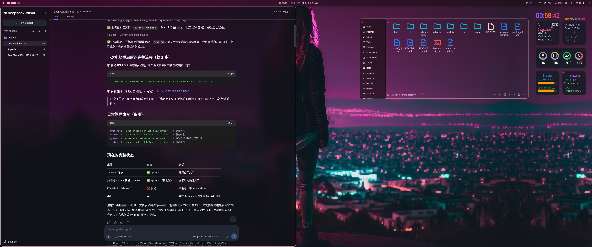

# dsh-desktop-electron

English | [中文](README.zh.md)

An Electron desktop shell for the [DeepSeek Harness](https://github.com/deepseek-harness) (`dsh`) Web GUI: it spawns `dsh web`, waits for the server's readiness line, and hosts the GUI in a standalone window with tray residency.

Compatibility was verified against the last currently available internal-test CLI, `@deepseek-ai/dsh` `0.0.1-rc.1` (`snapshot-20260811T152241Z-da262ec14c`). The shell relies only on the maintained `dsh web --host <host> --port <port>` arguments and the `dsh web: <URL>` readiness line.

> This repository is a DSH internal-testing community repo under the `dsh-external` organization. It carries **no harness source code** — the backend is your own `dsh` installation. The organization is not guaranteed to outlive the internal-testing period; keep your own copy.

## What this is

The Web GUI is the harness's richest surface but normally lives in a browser tab: no taskbar presence, no tray, and every launch means opening a terminal and keeping the tab alive. This shell makes it a real desktop window.

It is a **shell only**. It bundles no Node runtime and no harness closure — it runs whatever `dsh web` your machine already provides, so it stays correct across harness upgrades instead of pinning a snapshot.



| | |
|---|---|
| **Window** | Sandboxed renderer (`sandbox: true`, `contextIsolation: true`, `nodeIntegration: false`; preload exposes only the IPC bridge the opacity slider needs) — the GUI is a normal web application |
| **Tray residency** | Closing the window hides it; the server keeps running. Only **Quit** terminates the server |
| **Single instance** | A second launch focuses the existing window instead of starting a second server |
| **No orphans** | Quit tree-kills the server; a reaper child also tree-kills it if the main process is ever hard-killed |
| **Platforms** | Windows, macOS, Linux — pure Node/npm toolchain, no Rust/Go/Swift |

## Requirements

A working `dsh web`, resolved in this order:

1. **`DSH_BIN`** — an explicit path to a `dsh` executable;
2. **`DSH_HOME`** — a harness checkout root (`~/.dsh/source/current` for an `install.sh` install). Its built `apps/cli/lib/bin.js` is preferred; otherwise the tsx source launch is used, exactly as the checkout's own `pnpm run dsh` does;
3. **`dsh` on `PATH`**.

The server always listens on `127.0.0.1` with an OS-assigned port (`--port 0`), so it can never collide with an existing `dsh web` — a browser instance and this shell can run side by side.

## Run from source

```sh
npm install
DSH_HOME=~/.dsh/source/current npm run dev
```

## Package

```sh
npm run dist        # installers under release/
npm run dist:dir    # unpacked dir only, for a quick smoke
```

Installers are unsigned, so Windows SmartScreen and macOS Gatekeeper will warn on first run. The packaged app still needs a `dsh` on the host — see Requirements.

## Behavior notes

- **Windows permission mode.** Windows has no harness confinement backend, so the CLI's default `workspace-write` mode cannot boot there. When `DSH_PERMISSION_MODE` is unset the shell falls back to `danger-full-access` (approval prompts disabled) and logs a warning. Set `DSH_PERMISSION_MODE` explicitly to override.
- **Tree termination.** On Windows the kill is `taskkill /T /F`, because `child.kill()` is `TerminateProcess` of the direct child only. On POSIX the server is spawned detached and the whole process group is signalled, SIGTERM then SIGKILL after a grace period. The server does not run a graceful-dispose path; session data is written per event to JSONL, so a killed server loses nothing already logged.
- **External links.** Anything that opens a new window or navigates off the server origin goes to the system browser, restricted to `http(s)`; unparsable targets are dropped.
- **Workspace semantics** are the CLI's: the invoking directory is the default project root. Launching from a desktop shortcut starts in the shell's cwd, so prefer opening the app from a project directory or picking the Workspace in the GUI.
- **Transparent windows on Wayland.** The frosted-glass window needs a 32-bit (ARGB) visual. On compositors that expose their X server through xwayland-satellite (e.g. niri), that visual does not exist and the window silently falls back to opaque. When a Wayland session is present (`WAYLAND_DISPLAY` set), `npm run dev` launches Electron with `--ozone-platform=wayland` so the compositor's native ARGB surfaces are used; packaged builds need the same argument or `ELECTRON_OZONE_PLATFORM_HINT=wayland`.
- **Logs.** The server's stdout is forwarded with a `[dsh web]` prefix; run the app from a terminal to see both streams.

## Customizations

Local changes on top of the upstream shell:

- **DeepSeek blue theme**: floating surfaces — dialogs, dropdown menus, tooltips, inputs, buttons (including "new session"), the Appearance selection and plugin-config cards — switch from the theme's neutral grays to DeepSeek brand blue (a deep-blue glass family), matching the window glass tint. Implemented by injecting CSS custom properties into the hosted page (`src/glass.ts`), with separate palettes for dark and light.
- **Background-opacity slider**: a new "背景透明度 / Background opacity" slider below the Appearance row (Settings → General → Appearance), 40%–100%, applied live and persisted. The title follows the page locale. It talks to the main process through the new sandboxed preload (`src/preload.cts`) over IPC.
- **Trimmed tray menu**: the Opacity and Theme entries were removed from the tray context menu (Open Window / Quit only); theme and opacity are managed from the settings page.
- **Icons**: the window and tray icons are rendered in DeepSeek brand blue (`#4176e6`); `scripts/generate-icons.mjs` honors a `DSH_FAVICON` override for the favicon source and no longer forces the icon white under dark mode.
- **Fix**: live opacity/theme adjustments from the tray did not apply — repeated glass-guard injections stacked MutationObservers that overwrote each other's values; each injection now disconnects the previous observer first, so adjustments take effect immediately.
- **Embedded terminal + file browser**: a terminal toggle at the bottom edge opens a bottom terminal dock that starts at the conversation sidebar's right edge (never covering it) and squeezes the app up by the dock height, so the message input stays visible above it; a files toggle (top-right) opens a right-side file panel that squeezes the app horizontally (the conversation is never hidden) and is drag-resizable. Both use the page's translucent glass tokens for their backgrounds, so the frosted effect stays intact. Terminal tabs map 1:1 to main-process PTY sessions (`src/pty-registry.ts`), mirroring DSH better-sidebar semantics: an attach replays the bounded transcript, live output streams per tab, closing a tab releases its process, exited tabs show the code and respawn on re-attach, and a per-window cap bounds concurrent shells. Font family/size persist to localStorage and the xterm theme follows the page's dark/light tokens in place. The file panel is a navigable browser — enter directories, back/forward/up history, click a file to preview (512 KiB-capped `dsh:fs-read`) — with git change badges: the current branch in the path bar and per-file `M/A/D/?` marks from `git status --porcelain` (`src/git-status.ts` via `dsh:git-status`).
- **Desktop feature toggles**: below the wallpaper control, the Theme Settings panel (主题设置) gained a "Desktop features" block — a show/hide switch for the file browser, a show/hide switch for the terminal dock (turning one off hides both the panel and its floating toggle button), and a number input for the top-left brand color-switch interval (1–600 s, default 10 s). Choices persist to localStorage and apply immediately via window events (`featureControlScript` ↔ `terminalScript`/`ambientStyleScript`).

## Tests

```sh
npm test        # 49 keyless cases: command resolution, readiness parsing, HTTP polling, PTY registry, git status
npm run typecheck
```

## Credits

The shell, the launcher, and the process-tree primitive were developed in a harness fork and contributed upstream; this repository is the standalone extraction. Related standalone shells in the organization: [dsh-desktop](https://github.com/dsh-external/dsh-desktop) (Go/Wails, Windows), [dsh-desktop-mac](https://github.com/dsh-external/dsh-desktop-mac) (Swift/WKWebView), [deepseek-harness-desktop](https://github.com/dsh-external/deepseek-harness-desktop) (Wails + Node SEA).

## License

[BSD 3-Clause](LICENSE), matching the harness.
